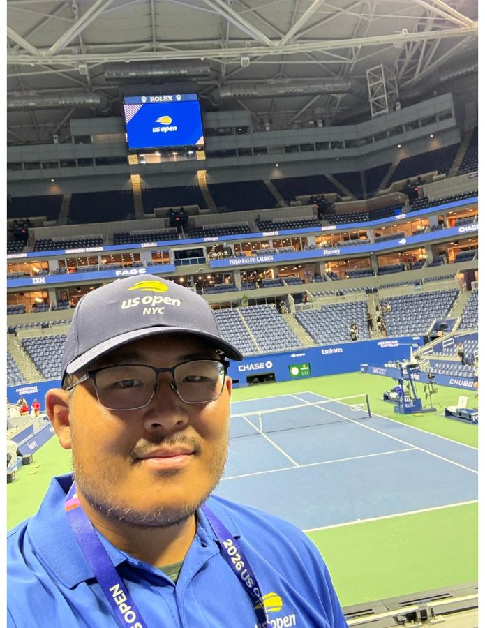
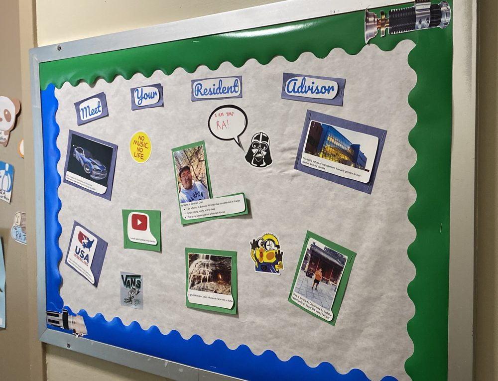

I'm a graduate student in Applied Business Analytics at Boston University with a finance degree from the University at Buffalo. My background combines financial services experience from an internship at Northwestern Mutual and a customer service position as guest services for the US Open in 2025 and 2026. Also in my time when I was a undergraduate, I served as a Resident Advisor to new incoming students. In other extracurricular activities, I was president of the UB Wrestling Club, and vice president of the Student of Management Minority Alliance.

[Download my résumé (PDF)](Resume.pdf){.btn .btn-primary}

## Education

:::: {.timeline}
::: {.timeline-item}
[2024 to present]{.timeline-date}
**Boston University**  
M.S. in Applied Business Analytics
:::

::: {.timeline-item}
[Graduated 2023]{.timeline-date}
**University at Buffalo**  
B.S. in Business Administration, concentration in Finance
:::
::::

## Experience

:::: {.timeline}
::: {.timeline-item}
[Aug to Sep 2026]{.timeline-date}
**Guest Services, US Open**  
I ensured I provided excellent customer service and resolved any issues that arose. I also helped with crowd control and safety measures, ensuring a smooth and enjoyable experience for all attendees. I also had the opportunity to work with a diverse group of people, including staff, volunteers, and spectators, which helped me develop my communication and teamwork skills.

:::

::: {.timeline-item} 
[November 2022- May 2023]{.timeline-date}
**Office assistant, University at Buffalo**
Aided residents with questions and concerns, and assisted with administrative tasks such as phone calls, emails, and questions or concerns from residents. 
:::

::: {.timeline-item}
[Aug 2021 to May 2023]{.timeline-date}
**Resident Advisor, University at Buffalo**  
Managed a floor of 26 residents, providing support and guidance to students in their academic and personal lives. I also organized events and activities to promote community building and engagement among residents. I was responsible for enforcing university policies and procedures, as well as responding to emergencies and crisis situations. 

:::

::: {.timeline-item}
[Jun to Aug 2022]{.timeline-date}
**Financial Advisor Intern, Northwestern Mutual**  
I set up client meetings and worked alongside current financial advisors during these client meetings over the summer. I also had the opportunity to learn about financial planning and investment strategies, as well as gain insight into the day-to-day operations of a financial advisory firm.
:::
::::
