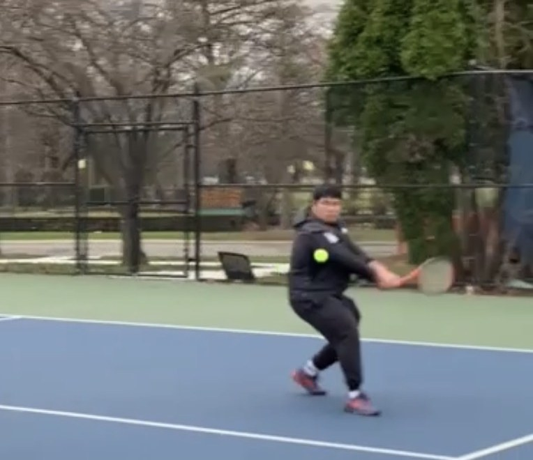
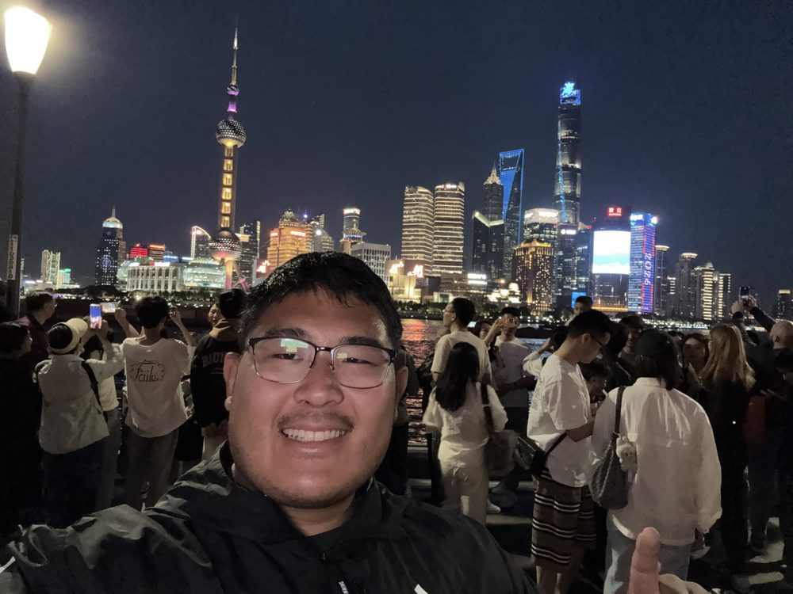

:::: {.hero}
::: {.hero-photo}

:::

::: {.hero-text}
[Jonathan Chen]{.hero-name}
[Business analytics grad student with a finance background]{.tagline}

I'm pursuing my M.S. in Applied Business Analytics at Boston 
University, with a strong interest in data analysis and the 
intersection of technology and business.

[View my projects](projects.qmd){.btn .btn-primary} 
[Download my résumé](Resume.pdf){.btn .btn-outline-primary}

[<i class="bi bi-envelope"></i> Email](mailto:jchenbu@bu.edu) · 
[<i class="bi bi-linkedin"></i> LinkedIn](https://www.linkedin.com/in/jonathanchen12) · 
[<i class="bi bi-github"></i> GitHub](https://github.com/jchenbu)
:::
::::

:::: {.stats}
::: {.stat}
[194%]{.stat-number}
[Projected ROI in my team's brewery feasibility study]{.stat-label}
:::

::: {.stat}
[10,000+]{.stat-number}
[Guests assisted at the US Open]{.stat-label}
:::

::: {.stat}
[26]{.stat-number}
[Residents managed as a Resident Advisor]{.stat-label}
:::
::::

## Background

I am current student in applied business analytics at University of Boston. I have a strong interest in data analysis and the intersection of technology and business. My other intrests besides this major is I enjoy playing sports such as tennis and basketball. For my career goals  This website serves as a portfolio to showcase my projects and skills. 

## Skills
- Programming Languages: Python, R, SQL
- Data Analysis: Pandas, NumPy, Matplotlib, Seaborn 
- Multitasking different tasks 
- Communication and collaboration 

## Career Goals
My career goals is that I hope I can be able to contribute to the field of data analysis and make a positive impact in the business world. I am particularly interested in leveraging data to drive decision-making and improve business outcomes. I am also passionate about continuous learning and staying up-to-date with the latest trends and technologies in the field of data analysis. I believe taking this route helps with my mission of helping others and making a positive impact in the world. I am excited to embark on this journey and look forward to the opportunities that lie ahead.

## Beyond Work

Outside of class, I enjoy playing sports, especially tennis. Also I have a strong intrest in automobiles. I enjoy attending auto events and car shows, where I can learn about the latest models and technologies. I also enjoy traveling to new places and experiencing different cultures. These activities help me maintain a healthy work-life balance and provide inspiration for my academic and professional pursuits.

::: {.photo-row layout-ncol=3}

:::