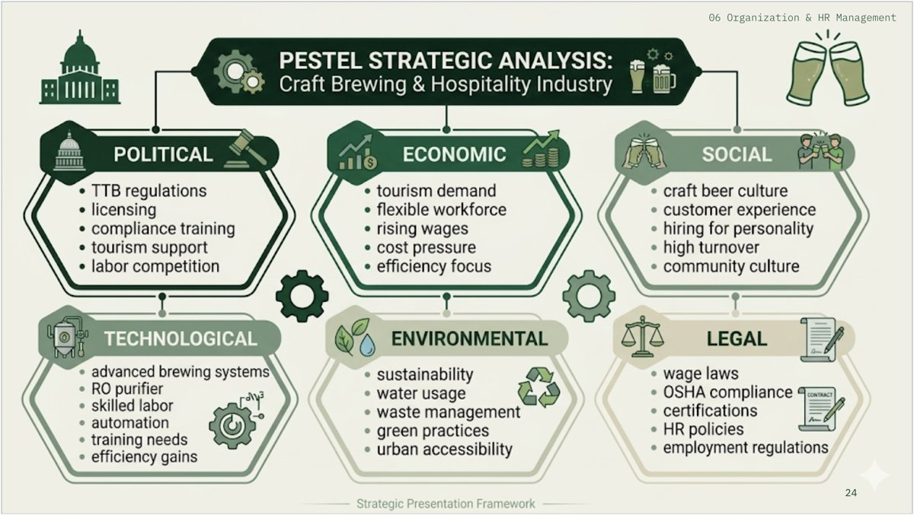
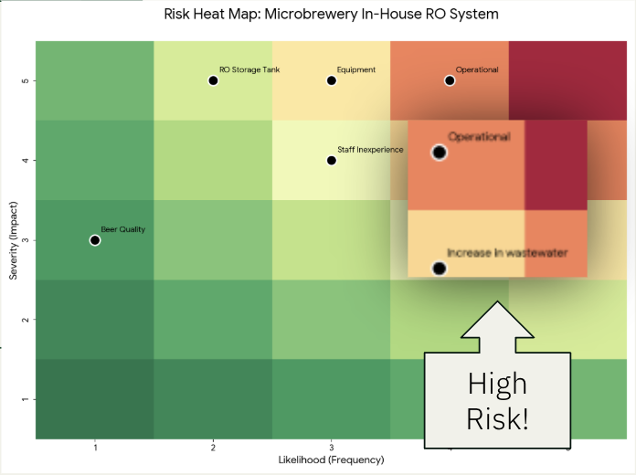

A selection of my academic and personal work in business analysis and 
analytics.

::::: {.project-card}
## Summit State Brewing Feasibility Study

*Team consulting project, four members*

[Financial modeling]{.skill} [Break-even analysis]{.skill} 
[Sensitivity analysis]{.skill} [Optimization]{.skill} 
[PESTEL]{.skill} [SWOT]{.skill} [VRIO]{.skill}

:::: {.stats}
::: {.stat}
[194%]{.stat-number}
[Projected ROI]{.stat-label}
:::

::: {.stat}
[6.68 mo]{.stat-number}
[Time to break even]{.stat-label}
:::

::: {.stat}
[$3.29M]{.stat-number}
[Median 3-year profit]{.stat-label}
:::
::::

**Problem.** 
Summit State Brewing was weighing whether to open a microbrewery on Denver's 16th Street Mall, a high-traffic but crowded craft beer market. The owner wanted a sustainable competitive advantage, ROI above 25%, and break-even within a year.

**Approach.** 
Using a business simulation platform, we modeled three-year revenue, cost, and profit projections across marketing, finance, operations, technology, and HR, comparing scenarios to find the strongest combination of pricing, costs, and staffing.

**Result.** My group recommended investing. The plan beat every one of the owner's targets, and our sensitivity analysis showed that pricing drives profitability far more than cost increases do.

**My role.** 
I contributed to the organization and HR analysis. We designed a lean staffing structure and recommended lowering salary growth from 12% to 8% with performance-based incentives, which 
improved the break-even point and cut the revenue needed to break even by nearly $10,000.

::: {layout-ncol=2}

:::

::: {.callout-note collapse="true" title="More detail on the analysis"}
- Ran a break-even analysis on $281,600 in annual fixed costs and a $5.15 contribution margin per pint, showing break-even at 54,680 pints per year, within production capacity
- Tested seven variables in a sensitivity analysis, including wholesale and retail prices, material costs, and loan amount
- Compared three-year financial projections across candidate scenarios to select the strongest option on net profit growth
- Scored operational risks by likelihood and severity to identify the highest-priority threats
:::

[View the presentation (PDF)](summit-state-feasibility.pdf){.btn .btn-primary}
:::::

## Personal Portfolio Website

**Tools:** Quarto, Git, GitHub Pages, VS Code

Designed and built this website to present my academic work and 
professional background.

- Built a multi-page site in Quarto with custom navigation and theming
- Managed version control with Git and deployed through GitHub Pages
- Optimized images and layout for fast loading

[View the source on GitHub](https://github.com/jchenbu/jchenbu.github.io)
